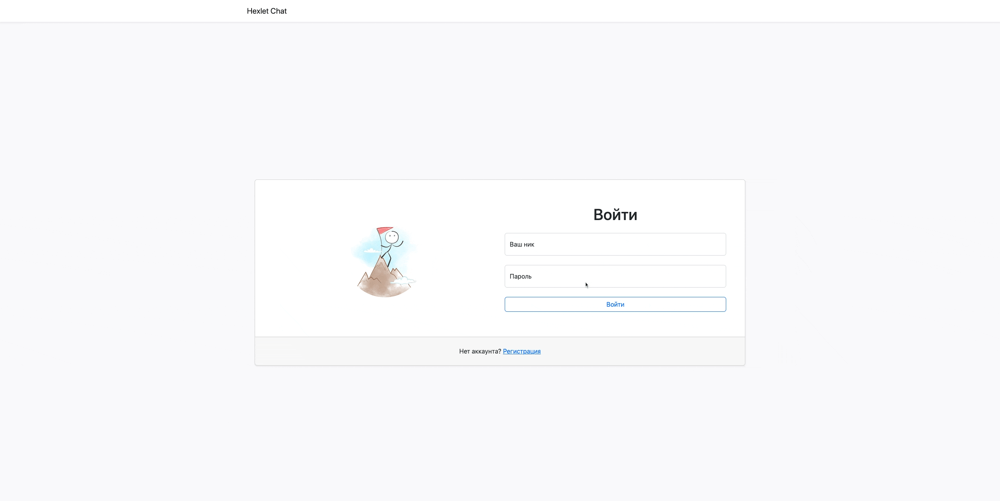

### Hexlet tests and linter status:

[](https://github.com/nightshiftmaster/frontend-project-12/actions)
<a href="https://codeclimate.com/github/nightshiftmaster/frontend-project-12/maintainability"></a>

## About:

A Hexlet Chat app is a platform for users to communicate with each other in real-time. The app typically requires users to create an account or sign in to start chatting.

The app could include features such as:

1. One-on-one messaging: Users could send direct messages to each other to have private conversations.

2. Group messaging: Users could create chat groups for specific topics or interests, allowing them to chat with multiple people at once.

3. Emojis: Users could use emojis to express emotions and add a fun element to their conversations


[Click here to see an example !](https://frontend-project-12-enn8y01ru-nightshiftmaster.vercel.app/login)


## Setup

```sh
$ make install
```

## Development

```sh
$ make start
```

## Preview

